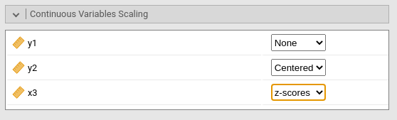

```{r echo=FALSE,results='hide'}
source("../R/constants.R")
source("../R/functions.R")
```

`r keywords("pathj,jamovi, path analyis")`

**PATHJ** module of the PATHj suite for jamovi

`r version("0.2.*")` 
`r draft`


# Introduction

The `r modulename` module represents a `r jamovi` interface to `lavaan` R package [@lavaan]. It implements path analysis, so SEM models with observed variables (no latent variables). The module handles continuous dependent (endogenous) variables, continuous and categorical independent (exogenous) variables, linear and interaction effects. Path diagrams are available thanks to R package `semPlot` [@semplot]. Please refer to these package help for detail about the model estimation and path diagrams features.  

# User Interface

To open `r modulename`, one clicks on the `SEM` menu, and then `Path Analysis` under `pathj`.

Like any `r jamovi` module, the input user interface resides on the left panel of the `Analysis` pane. All options are in foldable panels, divided more or less by topic. The only not foldable panel is the variable role definition panel, the one at the top.

`r pic("pics/help/input_variables_role.png")`

To run a model, we first select the variables and their role. ``r opt("Endogenous Variables")` are the one that will receive a path in the final model. Exogenous Variables are specified depending on their measurement levels. Categorical exogenous go in `r opt("Exogenous Factors")`, continuous variables for in `r opt("Exogenous Covariates")`. 

Factors are handled by decomposing the variable in K-1 contrast variable and insert in the model in place of the categorical variable. The type of contrast used, for each factor, can be seen in the `r ("Factor Coding")` tab.

Continuous variable are left unchanged, but their scale can be changed in the `Continuous Variables Scaling` tab, for easily centering, or standardizing the variables. 

`Multigroup Analysis Factor` is used to run multigroup analyses.

A model with two endogenous variables, one continuous and one factor as exogenous predictors is sets ar follows:

`r pic("pics/help/input_variables_filled.png")`

## Endogenous Models

Here we specify each endogenous variable predictors. First one selects on the right panel the endogenous model that needs to be set, then select the predictor(s) and fill the field with the arrow. Interactions among predictors are included by selecting more then one term on the left, and bring the on the right panel with the arrow (see [interactions in pathj]() for more info)

`r pic("pics/help/input_endogenous.png")`

In this example, `y1` is predicted by `y2`, `x3` and `groups_a` variables, whereas `y2` is predicted by `x3` and `groups_a`. 

## Variances and Covariances

By default, `r modulename` estimate the variances and the covariances among endogenous variables. More pricesily, among variables that represent end nodes of the path diagram. This behavior is controlled by the option `r opt("Free Parameters -> Endogenous Correlations")`. If not selected, only the variances are estimated, and the covariances are set to 0. 

The variances and covariances of the exogenous variables are computed from the sample data. In case one wants to estimate the population variances and covariances also for the exogenous variables, one should de-select the option `r opt("Miscellaneous -> Fixed Exogenous")` in the `r opt("Parameters Options")` panel, or select the terms pair and bring it in the right panel.

Any variance or covariance not already present in the model can be estimated by selecting the appropriate terms pair on the left panel and bring it to the right panel. In this example, the estimation of the variance of variable `x3` is required.


`r pic("pics/help/input_varcov.png")`

## Model Options

`r pic("pics/help/input_modeloptions.png")`

Here we find some options regarding the estimation of the model as a whole. 
`r opt("Estimation")` regards the estimator. At the moment, there are the following estimators available, selected by `r opt("Method")` combobox:

        - name:  ML
          title: Maximum Lik
        - name: GLS 
          title: Generalized least squares
        - name: WLS 
          title: Weighted LS
        - name: DWLS
          title: Diagonally weighted LS
        - name: ULS
          title: Unweighted LS

All explanations regarding the estimators can be found in the great [lavaan documentation](https://lavaan.ugent.be/tutorial/est.html) 

The options `r opt("R-squared tests")` provides Chi-squared tests for the $R2$. Details can be found here [Computation details](pathj_details.html)

## Parameters Options

Here we find options regarding how to compute and display different parameters. 

## Factor Coding


Categorical variables are cast in the model according to different coding schemas. The coding schema applies to all parameters estimates. The default coding schema is `r opt("simple")`, which is centered to zero and compares each means with the reference category mean. The reference category is the first appearing in the variable levels. 

Note that all contrasts but `r opt("dummy")` guarantee to be centered to zero (intercept being the grand mean), so when involved in interactions the other variables coefficients can be interpret as (main) average effects. If contrast `r opt("dummy")` is set, the intercept and the effects of other variables in interactions are estimated for the first group of the categorical IV.  

Contrasts definitions can be seen in the output by selecting `r opt("Show contrast definition table")`. 

Contrasts variables are always named with the name of the factor and progressive numbers from 1 to K-1, where K is the number of levels of the factor.

In reading the contrast definition table, one should interpret the `(1,2,3)` code as meaning "the mean of the levels 1,2, and 3 pooled toghether". If factor levels 1,2 and 3 are all levels of the factor in the samples, `(1,2,3)` is equivalent to "the mean of the sample". For example, for a three levels factor, a contrast labeled `1-(1,2,3)` means that the contrast is comparing the mean of level 1 against the mean of the sample. For the same factor, a contrast labeled `1-(2,3)` indicates a comparison between level 1 mean and the subsequent levels means pooled together.

More details can be find in `r link_pages(nickname="categorical_variables")` and in [GAMLj module help](https://gamlj.github.io/rosetta_contrasts.html), which implements the same logic of contrasts.


## Continuous Variables Scaling



Continuous variables by default are not changed in scale (`r opt("none")`), but one can center (`r opt("centered")`) them, standardize them (`r opt("z-scores")`), log-transform (`r opt("Log")`). Centering may be useful when interactions are involved in the model.


# Examples

Some worked out examples of the analyses carried out with jamovi PATHj are posted here (more to come)

`r include_examples("pathj")`

# Details

Some more information about the module specs can be found here

`r include_details("pathj")`


`r issues()`

'
