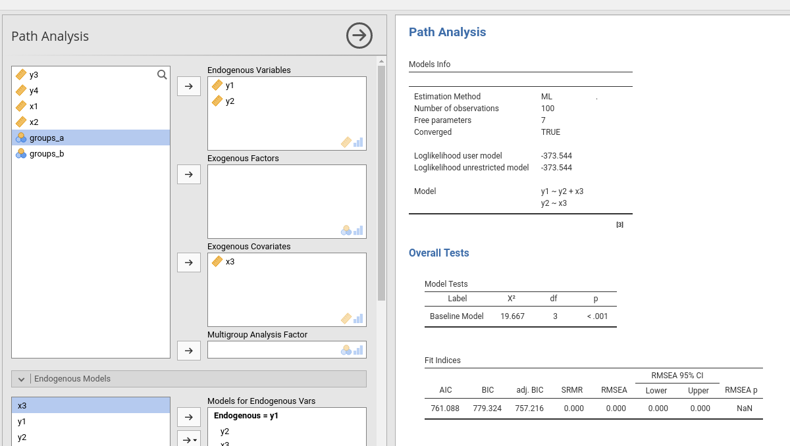
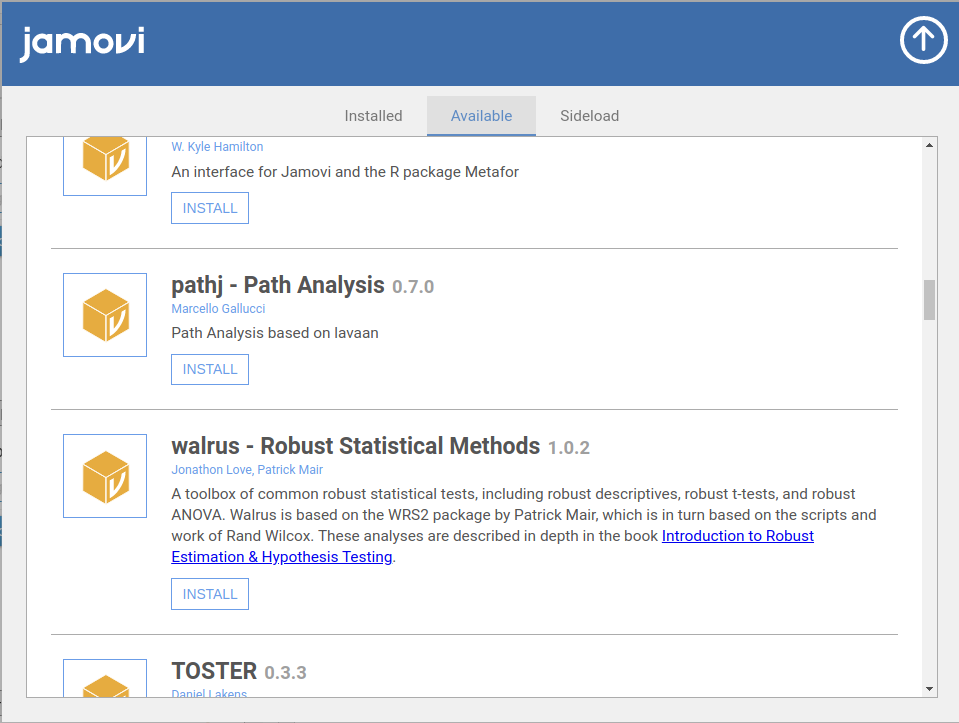

  

```{r echo=FALSE,results='hide'}
mcdocs::mcdocs_init()
```
  

Path analysis for jamovi based on R package lavaan



## Help


Please visti the [Help](help.html) tab for usage information of the module in `r jamovi`. For usage information in R, please visit the 'PATHj in R' tab.

## Examples

Some worked out examples of the analyses carried out with jamovi `r modulename()` are posted in the  [Examples](examples.html) tab (more to come)

`r list_pages(topic="pathj",category = "example")`


# Installation

## In jamovi

Please visit the `r jamovi` library within the software



## Install in R

To install it in R, simply use:

```

devtools::install_github("pathj/pathj")

```

# Release notes

Please check out the  [Release notes](release_notes.html). 

# Quality control

Please check the [rosetta store](rosetta.html) for alignment with other software results and possible discrepancies.

  
`r issues()`

